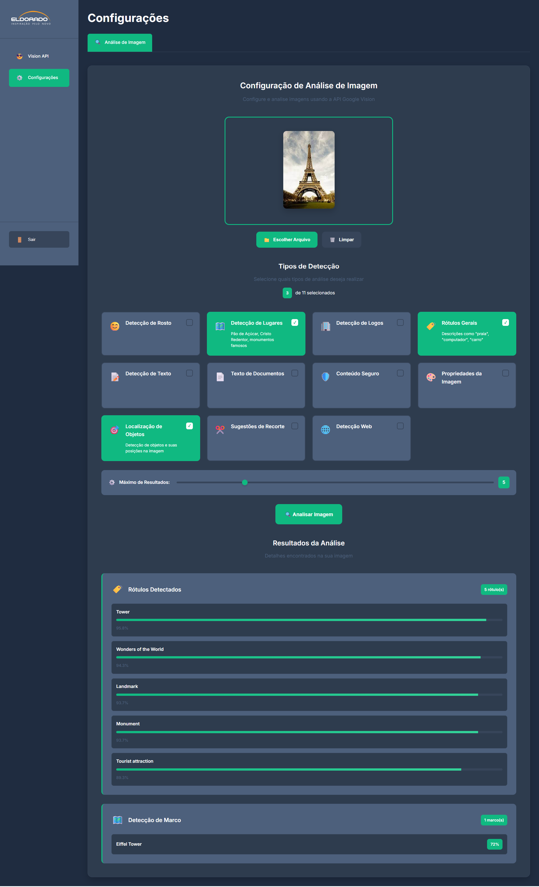

# Vision API Frontend

Frontend Angular para análise de imagens usando a Google Vision API.



## 📸 Screenshot do Sistema

## 🚀 Funcionalidades

- **Upload de Imagens**: Suporte para JPG, PNG, GIF e BMP
- **11 Tipos de Detecção**:
  - Detecção de Rosto (emoções, pose, qualidade)
  - Detecção de Lugares Famosos
  - Detecção de Logos
  - Rótulos Gerais
  - Detecção de Texto (OCR)
  - Texto de Documentos
  - Análise de Segurança
  - Propriedades da Imagem
  - Localização de Objetos
  - Sugestões de Recorte
  - Detecção Web

## 🛠️ Tecnologias

- **Angular 20** com standalone components
- **TypeScript** com tipagem estrita
- **Google Vision API** para análise de imagens
- **CSS Variables** para design system
- **Responsive Design** mobile-first

## 📋 Pré-requisitos

- Node.js 18+ 
- npm ou yarn
- Google Cloud Platform account
- Vision API habilitada
- API Key válida

## 🔧 Instalação

1. **Clone o repositório**:
```bash
git clone <repository-url>
cd vision-api-frontend
```

2. **Instale as dependências**:
```bash
npm install
```

3. **Configure as variáveis de ambiente**:
   - Copie `src/environments/environment.ts` para `src/environments/environment.prod.ts`
   - Atualize a API key em ambos os arquivos

4. **Execute o projeto**:
```bash
npm start
```

## ⚙️ Configuração

### Variáveis de Ambiente

```typescript
// src/environments/environment.ts
export const environment = {
  production: false,
  apiUrl: 'https://vision.googleapis.com/v1/images:annotate',
  apiKey: 'SUA_API_KEY_AQUI'
};
```

### Google Cloud Vision API

1. Acesse [Google Cloud Console](https://console.cloud.google.com/)
2. Crie um projeto ou selecione um existente
3. Habilite a Vision API
4. Crie uma API Key
5. Configure restrições de segurança (recomendado)

## 🚀 Uso

1. **Acesse a aplicação** em `http://localhost:4200`
2. **Faça upload de uma imagem** clicando na área de upload
3. **Selecione os tipos de detecção** desejados
4. **Clique em "Analisar Imagem"**
5. **Visualize os resultados** organizados por categoria


## 📱 Responsividade

- **Mobile-first** design
- **Sidebar colapsável** em telas pequenas
- **Grid adaptativo** para diferentes tamanhos de tela
- **Touch-friendly** para dispositivos móveis

## 🔒 Segurança

- **Validação de arquivos** (tipo e tamanho)
- **API Key** em variáveis de ambiente
- **Tratamento de erros** robusto
- **Validação de entrada** em todos os campos

## 🧪 Testes

```bash
# Executar testes unitários
npm test

# Executar testes com coverage
npm run test:coverage
```

## 📦 Build

```bash
# Build de desenvolvimento
npm run build

# Build de produção
npm run build -- --configuration production
```

## 🐛 Troubleshooting

### Erro de API Key
- Verifique se a API Key está configurada corretamente
- Confirme se a Vision API está habilitada
- Verifique as restrições de segurança da API Key

### Erro de CORS
- A API do Google não tem problemas de CORS
- Verifique se a URL da API está correta

### Arquivo muito grande
- Limite máximo: 10MB
- Use compressão de imagem se necessário

## 📄 Licença

Este projeto está sob a licença MIT.

## 🤝 Contribuição

1. Fork o projeto
2. Crie uma branch para sua feature (`git checkout -b feature/AmazingFeature`)
3. Commit suas mudanças (`git commit -m 'Add some AmazingFeature'`)
4. Push para a branch (`git push origin feature/AmazingFeature`)
5. Abra um Pull Request

## 📞 Suporte

Para dúvidas ou problemas:
- Abra uma issue no GitHub
- Consulte a [documentação da Google Vision API](https://cloud.google.com/vision/docs)
